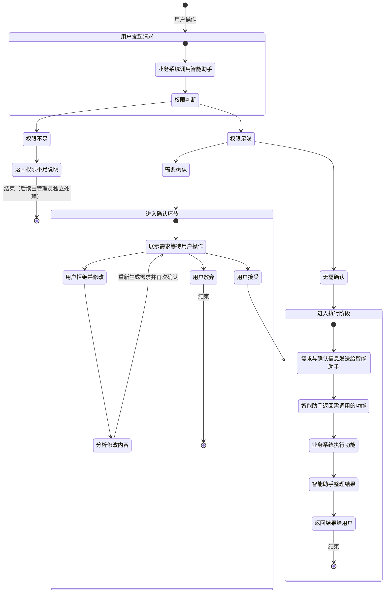

# 引入AI, 如何呢?

>  模型采用GLM 4.7 Flash, 开源模型

## CHECK LIST


- [x] 数据库结构修改
  - [x] bill_participate里再增加一个weight浮点数字段. weight 在落库前需要归一化.
  - [x] duty里增加task字段, 用文本描述这个任务的具体工作, 而不是笼统的"值日"
    也就是说, 一天可以有多个人有各自的duties
  - [x] 账单引入权重之后, **账单的删除要注意级联**
- [x] 不改变功能, 提高代码的复用性, 可读性, 进行组件化, 每个文件建议200行左右, 不得超过300行; 每个方法40行左右, 不得超过50行. 不得出现钻石
- [x] 允许每一个设置卡片进行收缩成一行, 只保留第一行的标题


### 短期记忆

- [x] "BASE_URL", "API_KEY", "MODEL" 统统放到配置文件
- [x] 流式输出
- [x] 限制输入输出token
- [x] 允许用户设置短期记忆(在机器人)


  - [x] 短期记忆是一个滑动窗口, 是n条聊天记录
  - [x] 这n条聊天记录, 要在前面标注说话的那个人的用户名/或者用户ID
  - [x] 增加一个短期记忆长度的设置界面(在机器人卡片内, 機器人的其他內容这一块之上, 機器人設定之下), 可以设置个数(1-35), 并提示:
    - 5-10 简单聊天
    - 10-15 高强度使用机器人, 需要使用 Function Call 的功能
    - 15-20 技术交流
    - 20-30 超活跃群聊
  - [x] 检查用户在输入的时候, 有无故意注入用户名
- [x] 当配置env为echo时, 直接不请求, 直接把已经构造好的各个请求参数返回给前端


### 消息的特殊属性

- [x] 右键(移动界面是长按)每一条消息，可以出现这多个选项(菜单栏)。
- [x] 为了终止LLM持续输出, 可以在上面强制终止
- [x] 为了保护隐私. 加一个每条消息上标注一下这条消息是隐私的功能，那就不会为给ai。
  - 需要将这个隐私的标记持久化
  - 隐私标记对所有成员共享
- [x] 给每条消息，加一个"将此消息加入机器人上下文"的功能, 并在消息上标记. 
  - 这个标记不会将这个持久化到后端, 只在与机器人的一次请求时候生效, 请求结束则选中失效
  - 加入到上下文的话，最多不能超过n条(参考设置的上下文)。
  - 如果使用了指定上下文, 那后端就不会使用维护的窗口
  - 携带这个信息发起@Robot请求后, 这个上下文就不会再启用了, 恢复到默认的窗口
  - 手动携带的消息不对其他成员共享
  - 如果这条消息上有隐私标记, 则阻止用户标记这个消息(弹窗提醒用户, 弹窗能被叉掉, 也能过一段时间自动消失)
  - 如果选中一些消息, 却迟迟不发送机器人请求, 也不要丢失了这些标记, 除非用户清空浏览器记录, 否则不要丢失(localstorage).


### Tool call


- [ ] 如果机器人调用了Tool, 需要把它做了什么都告诉用户, 做了什么, 参数是啥
- [ ] AI权限设置(舍长可设置, 且仅能手动设置)(在机器人卡)
- [ ] Tool call 的配置写一个文件, tool call 的 function 写入一个文件夹下, 一个funciton对应一个文件


需要思考的人机交互

- 设置界面, 机器人调用 Tool 权限设置 select
- 每次询问的界面 (无)
  - 弹出?
  - 气泡下的按钮?
  - 按钮是多个, 还是select+确认?
- 提示词:
  - 如果用户不特别说明, 如果用户询问Tool, 则给他显示整理总结过后的Tool使用
  - 如果用户说了要json的详细说明, 允许把tool列表展示给用户


### 历史整理与压缩


- [ ] 压缩长期记忆
  - [ ] 对聊天记录的整理概括(一个check point, 来记录, 到目前为止, 几条消息被传输给了AI 让AI完成了总结, 有哪些没有), 是否需要触发自动总结? 每超过n条聊天记录, 自动总结?
  - [ ] 短期记忆被淘汰后, 会被进行和长期记忆合并, 然后交给AI总结?
  - [ ] 引入增量式的数条聊天记录总结?
  - [ ] 手动压缩: 可以在设置里点击压缩, 然后召唤机器人进行总结, 压缩
  - [ ] 自动压缩: 发现了长期记忆过长, 则机器人对长期记忆进行自动更新压缩(总结)
  - [ ] 自动更新后, 通知舍长
- [ ] 整理聊天记录

  - [ ] 彻底异步
  - [ ] 完成后发送消息
  - [ ] 点击整理聊天记录的消息之后, 弹出消息的内容


思考界面如何展示

手动压缩的时候

- 如果是让机器人输出消息, 那么所有人都能看到了, 这好吗? 似乎不太好
- 如果是完全异步总结, 完成后发送通知, 点击了通知弹窗一个markdown文件, 可以查看总结的结果, 似乎也不错


### 其他功能


- [ ] 联网搜索(API调用)

- [ ] 消息免打扰的功能(是否真的要做? 感觉没必要)
  - [ ] 右键(移动界面是长按)左边栏出现菜单栏, 可以设置某个免打扰
  - [ ] 需要持久化设置
  - [ ] 如果设置了免打扰, 那么再次点击, 那么是取消免打扰


- [ ] 限额(如果要做也是最后做, 否则就是对测试不利了)
  - [ ] 每个宿舍每小时可以使用AI 20 次, 每天可以使用100次 ( 数值待定 TODO )
  - [ ] 限制LLM的token数量
  - [ ] 考虑到一次Toolcall其实涉及不止一次请求, 因此要特别考虑?


## Prompt

> 暂定

```test
你是一个宿舍的群聊助手，需要根据整个对话历史理解用户的最新问题。注意：
- 对话中可能有多人发言，你需要综合所有信息。
- 如果最新问题中缺少明确的时间或地点，请从历史中推理。
- 回答前先思考：用户想查什么？地点？时间？从历史中找线索。
- 回答长度不得超过: 800字. 尽量紧扣用户的问题
- 请直接回答用户问题，不要复述或讨论这些指令。
- 请保守调用Toolcall, 如果参数不能确定, 请优先询问用户, 而不是猜测. (当然, 有些参数是有默认值的, 那就可以调用)
```


## Long Turn Memory

### 结构

```json
{
  "robot":{
    "name": "萝卜头", // 舍长可设置
    "character": [// 舍长可设置, 人设
      {
        "field": "人设",
        "value": "可爱的猫娘JK"
      },{
        "field": "语气",
        "value": "娇嗔的"
      }
    ]
  },
  "dorm":{ // 宿舍信息
    "name": "dorm-123", // 宿舍名
    "members":[
      {
        "id": 23,// 服务端提供
        "name": "宿舍成员A",// 服务端提供
        "leader": true,// 服务端提供
        "description": "最帅" // 可用户修改, 舍长可以改全员, 成员可以改自己
      },
      {
        "id": 24,
        "name": "宿舍成员B",
        "leader": false,
        "description": "最可爱"
      }
    ]
  },
  "metaData":{ // 元数据, 表示基础数据
      "nowTime": "yyyy-MM-dd hh:mm:ss",//后端提供
      "nowTimestamp": "17321898398",//后端提供, 单位s
      "longMemoryMaxLength": 1111,//后端提供, 保证是和其他地方统一
      "outputLimit": "输出限制长度"//...
      // TODO 待丰富
  },
  "longMemory": "长文本, 交给AI总结, Maybe markdown, 可供用户编辑" // 舍长可以修改
}
```

### 可行性分析

现在需要解决的问题是, 上传上下文的长度过长. 如果开放长度是30条上下文, 这30条记录如果都是机器人发的, 且都有1000字, 那么, 将导致上传的内容变成30k的token, 加上system prompt, 大概有5k, 那就是35k,但是200k的容许上下文, 应该OK?

那如果我要总结, 那历史就是100条, 每条1k, 那就是100k, 依旧具有可行性

- **定制系统prompt, 这个prompt可以简单一些**


### 内核设计

- **数据库已经有的数据, 使用脚本写一个虚假的总结, 填充数据库**
- 特殊的Prompt(携带用户信息/时间戳和时间/机器人的名字, 信息可以比一般的聊天少, 这样可以更多地把资源留给历史记录)
- 消息的总结需要另外一个数据表
  - 总结的消息的开始时间 datatime 或者 timestamp, 从消息表中来, 最早一条消息
  - 总结的消息的结束时间 datatime 或者 timestamp, 从消息表中来, 最后一条消息
  - 总结内容, 长度进行适当限制
  - 总结粒度: 年/月/日
  - 其他合适的元数据

对于任意长度的消息总结, 长期记忆其实也是消息总结

需求是: 要总结最近期的n条消息

1. 总结一天的消息(从凌晨四点开始到次日凌晨四点)

2. 一天的消息分为多个mini_batch, 每一个mini_batch发送给LLM总结

   有时候一天一个mini_batch都不到也有可能, 那凑, 凑就好几天加在一起发起一次总结

   然后这个总结的提示词里, 需要标注从哪里开始, 日期发生了变化

3. 滚动上下文, 0-110, 100-210, 200-310, 300-410, 400-510, 500-610, 存在重叠部分

4. 多个mini_batch再一齐发给LLM, 一天的聊天记录总结成文本, 落库

5. 如果满一个月了, 则自动整理一个月的每日记录, 落库

6. 如果满一年了, 整理一年的每月记录, 落库

7. 使用 write_pos 来记录已经总结过的数据, 如果一天前半部分进入了mini_batch 并总结, 后半部分凑不齐一个mini_batch, 则前半部分先落盘, 后半部分先不发起请求, 和之后的日子里的消息一起凑到mini_batch后再发起请求, 减少请求次数, 节省LLM调用

8. 总结是定时任务

9. 如果要手动查, 两年+今年前7个月+本月前20天+今日到此刻之前的所有消息, 只需要

   - 两份年记录
   - 七份月记录
   - 20份日记录
   - 今日已经发出的 x 条消息记录(也可以引入mini_batch)

   总结之后返回给客户端


- 欸, 定时任务的性能损耗令人伤心
- 如果引入了更复杂的Agent Loop, 那么就可以让机器人依据年月日的总结, 去查询某一条具体消息的出处了


## Skill

### 流程

做了舍长确认机制, 那是不是也要引入参数二次确认机制了?

要么都做, 要么都不做? 因为两个逻辑差不多?

策略

- 确认机制
  - 考虑到一次请求可能带来多个Toolcall 因此需要展示的是列表
  - 可以有舍长审核机制
- 没有确认, 直接通过, 做的不对再让AI删除重做
  - 界面更少, 但是请求更多
  - 这个策略就没有舍长审核机制了, 只能在Tool里对权限不足的操作失败, 然后告诉用户
  - 居然挺适配的, 其实也不需要太严格的流程和操作, 只要这种符合人直接的操作即可, 让AI先尝试去做, Tools 自然会保护好资源, 让AI不去做危险的事情, 然后将错误信息"需要舍长"来返回给AI, AI就会告诉用户需要舍长了, 然后就可以引入舍长机制了
  - 缺点是, 失败也算是一次请求, 需要发起多次请求了, 但是确认机制也是需要反复请求的
  - 但是依旧没有解决参数不符合用户用意的检查机制

#### 循环确认

那我们的策略就做成AI试错机制和确认机制合并

对于需要确认的操作(不考虑舍长)

```
1. 用户发起需求的消息到业务服务端
2. 业务服务端将消息发送给LLM
3. LLM 理解用户需求, 将自然语言整理成参数和目标工具, 然后展示给用户
	- 不展示工具名和参数名, 而是整理成语言描述
4. 用户对操作进行确认, 客户端将确认发送给业务服务端
5. 业务服务端将确认消息发送给LLM
6. LLM 返回Tool call (直到这一步才允许LLM进行Tool call, 前面只知道有什么工具, 却不能call)
7. 业务服务器执行Tool call
8. 业务服务器将执行结果告知 LLM
9. LLM 将信息整理之后返回给用户
10. 用户自己判断下一步操作
```

状态机的做法




#### 问题: 感知 ACK

问题在于, 如何知道这一条LLM需要ACK?

LLM 如果发起了Toolcall, 就不会有文本content的输出了, 我即希望有content输出, 向用户展示机器人是如何理解这个需求的, 又希望机器人能精确地触发确认的机制(确认将附带确认按钮和拒绝按钮)

一个解决方案是, 调用Toolcall, 将机器人对需求的理解作为参数传入ACK的Tool, 缺点是无法流式输出

采用**格式化输出**, 解决方案是舍弃流式输出

但是**格式化输出不如Toolcall可靠**, 但是Toolcall的参数如果是长文本将不利于 LLM 生成

#### 策略一: Tool 参数展示

1. LLM 分析用户需求, 返回需要调用哪些 Tool
2. 找出哪些 Tool 是需要 ACK 的. 
3. 把参数和 Tool 返回给客户端, 让其 ACK

缺点是页面展示困难, 比如有些参数是ID, 对于参数调用是方便的, 对于页面展示是不方便的(用户体验不佳, 对于用户ID转换成用户信息是合适的, 但是这样就很麻烦了)

#### 策略二: 多次请求

1. 第一次请求: LLM分析需求, 返回对用户的需求的理解
2. 第二次请求: LLM依据ToolList, 调用一个特定的 Tool, 指出哪些ToolList是需要被ACK的
3. 将ACK列表发送给客户端

缺点是多次请求API消耗比较大, 同时也要保证请求之间时间间隔足够大, 否则会被当成并发请求而拒绝(API 请求次数太多)

#### 策略三: 优化多次请求

优化多次请求, 把第二次请求的返回利用起来

1. 第一次请求: LLM分析需求, 输出自然语言文本
2. 第二次请求: LLM分析第一次的自然语言文本, 输出Toolcalls
3. 应用服务分析目标 Tool 是否需要 ACK, 生成 ACK 列表
4. 将ACK列表发送给客户端

这样, 如果客户端进行了 ACK 确认, 已有的Tool不需要再次请求了, 只需要执行被ACK的Tool即可(如果后一个Tool依赖于前一个怎么办)

缺点是 ACK 的按钮出现, 和自然语言文本出现的**时间差异大**

- 自然语言文本输出完毕后, 在消息的最后: 

  整理工具调用, 准备任务确认列表中, 请稍等, 进度是: ... 

  然后最后ACK列表准备完毕后, 替代这个提示文本. 

- 这个ACK列表是格式化的, 可以好好输出, 而且这个ACK列表不需要参数, 只需要函数名

一次ACK列表可能有多个ACK, 需要分开:

- 提示词: 如果有多个任务, 就划分的清晰一点
- 多个任务 tool call 需要注意一一对应, 但是不可, 有些操作不需要 ACK, 所以需要特别设计Tool Call

#### 策略四: 自然语言

不要搞ACK了

```.mermaid
stateDiagram-v2

    [*] --> 用户发起请求: 用户操作
    用户发起请求 --> 业务系统调用LLM
    业务系统调用LLM-->LLM初步判断
   	state LLM初步判断{
        [*] --> LLM分析判断
        LLM分析判断 --> 返回权限不足说明: 权限不足
        返回权限不足说明 --> [*]: 结束（后续由管理员独立处理）
        LLM分析判断 --> 返回Toolcall: 拥有权限
   	}
    返回Toolcall-->进入执行阶段
   	state 进入执行阶段{
        [*] --> 业务系统执行Toolcall
        业务系统执行Toolcall --> Tool结果返回
        Tool结果返回 --> 将结果和第一次请求一并发送给LLM
        将结果和第一次请求一并发送给LLM --> LLM返回自然语言结果
        LLM返回自然语言结果 --> 业务系统将结果返回给用户
   	}
	业务系统将结果返回给用户-->用户确认与判断
	state 用户确认与判断 {
        [*]-->用户判断: LLM是否理解正确,是否执行正确
        用户判断-->[*]: LLM是正确的,结束
        用户判断-->用户编写修改的请求: LLM是错误的
	}
	用户编写修改的请求 --> 用户发起请求
```


### 权限等级

#### 权限和ACK确认机制的区别

权限是在确认什么? ACK 机制又是在确认什么?

ACK 机制是在确认, AI 对问题的理解是否正确, 只有理解正确了, 才能让其执行这一条指令

权限是 AI 能做什么, 是否允许AI去做, 这不需要管AI是否理解正确. 只要 AI 调用了某个Toolcall, 就涉及这个 Tool 上的权限

因此, 虽然我们不做 ACK 机制的UI了, 但是权限的UI还是要做一下的

#### 机器人对Tool权限

对于每一个工具, AI 具备的权限

- 总是禁止 AI 执行某个 Tool (访问LLM时从ToolList中删除这个Tool)
- 总是允许 AI 执行某个 Tool (访问LLM时, 从ToolList中加入这个Tool)
- 询问(默认) , 把参数和调用的目标Tool整理成合适的格式后展示给用户(不做了, 撤销)
  - 本次允许 (按照权限)
  - 本次拒绝 (按照权限)
  - 允许, 下次总是允许 (只有舍长可见)
  - 拒绝, 下次总是拒绝 (只有舍长可见)

对于三种权限, 可以在机器人里配置, 就是一个Tool, 对应一个权限


#### 用户对Tool权限

对于一个需求, 想要 LLM 发起了一个ToolCall

1. LLM 检查, 如果要发起这个Tool Call, 提出请求的人够不够格
2. Tool 内部进行检查, 调用这个 Tool 的需求, 是不是够格的人发起的

所谓 **够格**, 就是指用户对 API 的访问权限

- 能够调用 
- 能够发起请求, 然后不进行调用, 而是将需求整理后返回, 让舍长或其他成员来发起真正的调用请求
- 不能发起调用(一般都能退到上一条)

分成以下情况

- 读操作: 总是允许
- 成员操作: 一般成员都有的操作. 比如发布账单. 总是允许.
- 本人操作: 写本人的数据. 例如支付本人的账单. 总是允许.
- 操作他人: 写他人的数据. 例如一般成员要删除. 一般成员不允许直接操作, 需要**舍长或他人允许**.
- 舍长独有操作: 只有舍长的操作. 例如发布值日任务. 一般成员不允许直接操作, 需要**舍长允许**允许.

所谓"他人"或"舍长"允许的实现方式: 

1. LLM 分析需求后, 先将用户的自然语言描述的需求, 进行一次整理和总结. 将问题逻辑理清, 加上不能进行调用的原因, 以自然语言的方式返回, 而不调用Tool
2. 舍长用自然语言说"@机器人 允许"这种意思的话, 机器人才真正执行Tools

这种方式对是**聊天记录上下文**天然适配的

具体的权限校验逻辑

```js
用户发起一个请求, 这个请求需要Tool;
应用服务端存储这个用户的ID;
向 LLM 发起请求, LLM 返回 Tool call;
function Tool权限校验函数(用户ID, Tool_name){
	// 1. 校验机器人有这个权限
	//	 1.1 机器人有权限. 进入2
	//	 1.2 机器人被禁止(不可能, 无权限的Tool不会被传输给机器人, 机器人不会知道有这个Tool)
	// 2. 校验用户调用者有这个权限
	//	 2.1 人有权限->进入3
	//	 2.2 人无权限
	//	 	2.2.1 涉及他人: 返回错误: 涉及他人->LLM获取到之后, 让发起者去找"他人"
	//		2.2.2 需要舍长: 返回错误: 需要舍长->LLM获取到之后, 让发起者去找"舍长"
	// 3. 有权限, 继续往下执行
};
Tool权限校验函数(取出应用服务端中存储的用户ID,LLM_Response.tool.name);
调用ToolCall(LLM返回的ToolCall的一些参数);
```


### ToolList

为了可扩展性, ToolList需要适当整理后存储到数据库, 即使 ToolList 是静态数据, 但这么设计是最解耦的

还需要Dorm-Robot 和 ToolList 的**权限映射表**, 作为中间表, 因此 ToolList 建表就很有必要了

- 发起者权限: 能修改/查询有关自己的内容, 不是自己的资源无法访问
- 舍长权限: 舍长具有权限

- 账单
  - 创建(发起者/舍长具有权限)
  - 删除(发起者/舍长具有权限). 
  - 查询
  - 对未支付账单设置已支付(发起者/舍长具有权限)
  - 对已支付账单恢复未支付(发起者/舍长具有权限)
- 值日任务
  - 创建(舍长权限)
  - 删除(发起者/舍长具有权限)
  - 查询
  - 对未完成任务设置已完成(发起者/舍长具有权限)
  - 对已完成任务恢复未完成(发起者/舍长具有权限)
- 设置机器人配置(舍长权限)
  - 修改短期记忆的记忆窗口长度。
  - 修改名字
  - 增加设定字段
  - 删除设定字段
  - 查询设置
- 设置自己的配置
  - 设置昵称(发起者权限, 舍长无特殊权限)
  - 设置语言(发起者权限, 舍长无特殊权限)
  - 设置描述(发起者/舍长权限)
- 舍长设置(舍长权限)
  - 移交舍长
  - 修改宿舍的名字


- 聊天记录
  - 总结, 成为长期记忆(是否做成自动的定时任务?)
  - 获取近期n条聊天记录
- Tool call 元操作, 用于辅助Toolcall
  - wait_ack, 允许确认 (NO): 
    - 用户允许本操作, 只需要进行确认即可, 于是调用此Tool, 发送给用户"允许确认"的请求, 等待用户确认. 调用此Tool说明进入了待执行状态
    - 如果用户连确认也不允许(例如只有舍长允许), 则不调用此Tool, 直接返回消息, 告知用户不可
  - get_tools 
    - 将工具列表查询出来
    - 一般在机器人上下文的列表, 由于为了机器人的权限控制, 是不会给全的
    - 但是调用这个tool, 是会把所有的tool, 以及对应的权限等信息给全
  - set_tool_auth
    - 设置机器人对tool的权限
    - **禁止: 这个工作必须人来手动做**, 可以让机器人强调这一点, 体现我们系统的人本主义思想


```ts
const tools = [
    {
        type: "function",
        function: {
            name: "create_bill",
            description: "创建账单",
            parameters: {
                type: "object",
                properties: {
                    cost: {
                        type: "integer",
                        description: "费用, 单位: 分; 总费用",
                    },
                    createBy: {
                        // 需要代码检查这个ID是否正确, 就看这个ID是否属于这个宿舍
                        type: "integer",
                        description: "提出创建账单的用户ID",
                    },
                    weights: {
                        type: "array",
                        description: "每个宿舍成员的分账权重。若该参数不传/传null/传空数组，则表示所有成员平分；若只给出部分成员，则未列出的成员不参与分账。",
                        items: {
                            type: "object",
                            properties: {
                                memberUserId: {
                                    // 需要代码检查这个ID是否正确, 就看这个ID是否属于这个宿舍.
                                    // 包括上面那个createBy的id, 和这里的id, 可以联合再一起进行一次批量的查询, 而不是做n个查询
                                    type: "integer",
                                    description: "宿舍成员的用户ID",
                                },
                                weight: {
                                    type: "number",
                                    description: "权重，各权重之和不要求为1，函数内部会归一化处理",
                                },
                            },
                            required: ["memberUserId", "weight"],
                            additionalProperties: false,
                        },
                    },
                },
                required: ["cost", "createBy"],
                additionalProperties: false,
            },
        },
    },
    {
        type: "function",
        function: {
            name: "create_duty",
            description: "创建值日任务。一般宿舍成员无法调用此工具，只有舍长能执行；或者说，在一般成员提出创建任务后，舍长用自然语言同意后，才能调用此工具。因此，如果是一般宿舍成员调用，你需要整理信息后输出并向舍长请求同意。",
            parameters: {
                type: "object",
                properties: {
                    memberUserId: {
                        // 需要代码检查这个ID是否正确, 就看这个ID是否属于这个宿舍
                        type: "integer",
                        description: "提出创建值日任务的用户ID",
                    },
                    task: {
                        type: "string",
                        description: "对值日任务的描述",
                    },
                    date: {
                        type: "string",
                        description: "安排的值日进行的日期（未来时间），格式 yyyy-mm-dd",
                        pattern: "^\\d{4}-\\d{2}-\\d{2}$",
                    },
                },
                required: ["memberUserId", "task", "date"],
                additionalProperties: false,
            },
        },
    },
    {
        type: "function",
        function: {
            name: "update_long_memory",
            description: "总结新记忆，并记录到长记忆配置文件中；如果长记忆文本过长，则总结压缩，保证不超字数。",
            parameters: {
                type: "object",
                properties: {
                    newLongMemory: {
                        type: "string",
                        description: "更新后的 longMemory 文本，要求字数在设定值以内，支持 Markdown 格式。",
                    },
                },
                required: ["newLongMemory"],
                additionalProperties: false,
            },
        },
    },
    {
        type: "function",
        function: {
            name: "update_robot_short_memory_length",
            description: "修改机器人短期记忆的记忆窗口长度。",
            parameters: {
                type: "object",
                properties: {
                    length: {
                        type: "integer",
                        description: "机器人的记忆窗口长度：5-10适合日常简单对话；10-15适合辅助日常任务；15-20适合技术交流；20-30适合超活跃群聊。",
                    },
                },
                required: ["length"],
                additionalProperties: false,
            },
        },
    },
    {
        type: "function",
        function: {
            name: "update_robot_name",
            description: "修改机器人的名字，只有在舍长要求调用或经过舍长允许时才可调用。",
            parameters: {
                type: "object",
                properties: {
                    name: {
                        type: "string",
                        description: "机器人的新名字",
                    },
                },
                required: ["name"],
                additionalProperties: false,
            },
        },
    },
    {
        type: "function",
        function: {
            name: "add_robot_character_field",
            description: "增加机器人的设定字段，只有在舍长要求调用或经过舍长允许时才可调用。如果键已存在，则覆盖；不存在则新增。",
            parameters: {
                type: "object",
                properties: {
                    fields: {
                        type: "array",
                        description: "多个键值对字段",
                        items: {
                            type: "object",
                            properties: {
                                field: {
                                    type: "string",
                                    description: "字段名",
                                },
                                value: {
                                    type: "string",
                                    description: "字段值",
                                },
                            },
                            required: ["field", "value"],
                            additionalProperties: false,
                        },
                    },
                },
                required: ["fields"],
                additionalProperties: false,
            },
        },
    },
    {
        type: "function",
        function: {
            name: "remove_robot_character_field",
            description: "删除机器人的设定字段，只有在舍长要求调用或经过舍长允许时才可调用。如果键存在则删除，不存在则忽略。",
            parameters: {
                type: "object",
                properties: {
                    fields: {
                        type: "array",
                        description: "待删除的键名数组",
                        items: {
                            type: "string",
                        },
                    },
                },
                required: ["fields"],
                additionalProperties: false,
            },
        },
    },
    {
        type: "function",
        function: {
            name: "get_chat_history",
            description: "获取指定时间点之前的聊天记录，可用于总结、回顾或分析对话内容",
            parameters: {
                type: "object",
                properties: {
                    datetime: {
                        type: "integer",
                        description: "起始时间点，时间戳，单位s。将获取该时间点之前的聊天记录",
                    },
                    count: {
                        type: "integer",
                        description: "需要获取的聊天记录数量，从指定时间点开始向上追溯",
                        minimum: 1,
                        maximum: 100,  // 可以根据实际需求调整上限
                    },
                },
                required: ["datetime", "count"],
                additionalProperties: false,
            },
        },
	}, 
    {
        type: "function",
        function: {
            name: "undo_tool_call",
            description: "对之前的内容进行undo",
            parameters: {
                type: "object",
                properties: {
                    datetime: {
                        type: "integer",
                        description: "起始时间点，时间戳，单位s。将获取该时间点之前的聊天记录",
                    },
                    count: {
                        type: "integer",
                        description: "需要获取的聊天记录数量，从指定时间点开始向上追溯",
                        minimum: 1,
                        maximum: 100,  // 可以根据实际需求调整上限
                    },
                },
                required: ["datetime", "count"],
                additionalProperties: false,
            },
        },
    }
];
```


